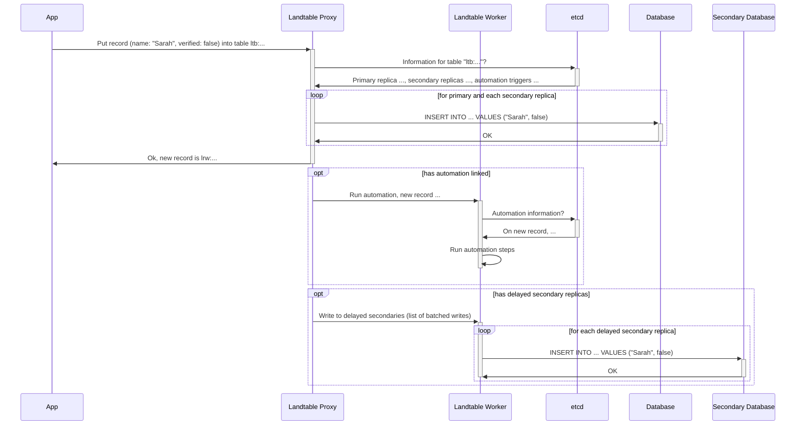

# landtable

> [!NOTE]
> Landtable is not ready for deployment. Nothing is finalised.
> No support is given if you try deploy Landtable right now.

Landtable is a familiar, easy-to-use proxy between your application and your
database. It provides a simpler interface to your database, so you can prototype
applications quickly.

## Who is Landtable for?

Landtable is primarily for people that already use products with similar APIs
and would like to migrate their data. While Landtable aims to be performant,
handling hundreds of thousands of operations per second is not a goal.

## Get started

TODO

## Licensing

Landtable is not open source software. Landtable is licensed under the
Polyform Perimeter license.

## Contributors

Thank you to:
- [Captainexpo-1](https://github.com/Captainexpo-1) for writing
  [an initial version of the Landtable formula parser](https://github.com/Captainexpo-1/Formula-Parser)
  (and agreeing to license the software under Landtable's license)

## Internals

### Landtable identifier format

Landtable uses a compact UUIDv4 representation (a UUIDv4 without the dashes).
Landtable identifiers start with:
- `lrw` for rows,
- `lfd` for fields,
- `ltb` for tables,
- `lwk` for workspaces.

Landtable keys (starting with `lky`) do not have a fixed representation.
Do not rely on there being one.

### Converting Airtable IDs to Landtable IDs

- cut off the first 3 characters (`recHiMhzCULf9TTF1` -> `HiMhzCULf9TTF1`)
- decode the rest as base62
- shuffle the bytes:
  - first 7 bytes of decoded identifier
  - 0b00000100
  - 0b10100000
  - last 7 bytes of decoded identifier (pad with zero bytes if needed)

### Journey of a request through Landtable

> [!NOTE]
> There are details not shown in the below diagram.
> It only aims to provide a high-level overview of how a request travels through
> Landtable.

