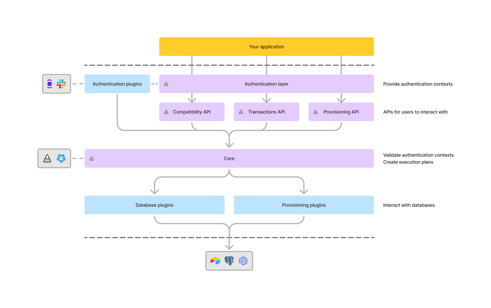

# landtable

> [!NOTE]
> Landtable is not finished. No support is available. Do not use
> Landtable right now.
> In particular, some information may be inaccurate.



This repository houses other projects too. For their documentation, see:
- [blorb](packages/blorb/README.md)

## What is Landtable?

Landtable is an easy-to-use proxy between your application and your
database.

### Easily migrate your data

Migrate existing Airtable-based apps to Landtable using the
**Compatibility API**, and use Airtable as a **database backend**. Then,
effortlessly move your data off of Airtable with **database replicas**.

Because Landtable uses existing database software, you can always stop
using Landtable if you want to. **Zero lock-in.**

### Solve compliance problems

With Landtable, you have **complete control over your databases.**
Choose to host your data wherever you want to comply with local
regulations.

### Boost productivity across every team

Developers will love the **Landtable IaC** tool to create tables with
code. With **managed databases**, Landtable can handle creating database
schemas for you. You'll never have to write SQL again.

### Security, always

Landtable integrates with your existing authentication systems with
**authentication plugins** and is
[built from the ground up for security.](docs/concepts.md)

### Built to scale

Built on proven technologies like **etcd**, Landtable fully supports
**horizontal scaling**.

### In the future

- Let non-technical teams interact with production data with Landtable
  Web.
- Use triggers and hooks to connect to external services.

---

## Get started

As a quick, developer-oriented way to start using Landtable, let's
create some tables with a local Postgres instance. For this, you will
need these services **running** on your computer:

- etcd
- Postgres
- Landtable

First, we'll start a Landtable instance.

```
landtable &
```

Then, we'll tell the Landtable IaC tool how to create tables.

```kdl
// meta.kdl
type "meta"
version 1

// Use the authentication plugin that effectively does nothing.
// Don't use this in production!
auth "unsafe_allow_all_requests_i_know_what_i_am_doing" {}

provisioning {
    strategy "Postgres" {
        using "postgres_provisioning_plugin"
        hostname "localhost"
        
        authentication "none"
        
        // or:
        /-authentication "userpass" {
            username "sarah"
            password "i_l0ve_hC!"
        }
    }
}
```

Then, we'll create a new workspace, and some tables inside it:

```kdl
// workspace.kdl
type "workspace"
version 1

name "High Seas"
alias "highseas"
alias "hs"

// Instructions on how to create this table from scratch.
// For this example, we'll just use 
primary_strategy extends="Postgres"

table "people" {
    // specify values as attributes...
    field "first_name" type="short_text"
    
    // ... or nested nodes
    field "last_name" {
        type "short_text"
        
        // change the column on the primary replica
        primary_config {
            column "name"
        }
    }
    
    // Computed fields!
    field "name" {
        type "formula"
        formula "{first_name} & \" \" & {last_name}"
    }
    
    field "email" type="email"
    
    // you can use nested nodes _and_ attributes even
    field "frumbicated_status" type="enum" {
        default "florp"
        
        enum "florp"
        enum "glorp"
        enum "gloop"
        enum "gleep"
    }
    
    // Landtable formulae can be saved in views!
    view "floorped_people" filter="{frumbicated_status} = \"florp\""
}
```

Deploy our changes with the Landtable IaC CLI:

```sh
$ landtable iac deploy workspace.kdl \  # deploy workspace.kdl
    --meta meta.kdl \                   # using meta.kdl
    --endpoint http://localhost:5963 \  # using a locally hosted endpoint

Fetching remote state
Please provide an authentication token for vault://vault.srh.dog/: XXXX
Computing required state changes
-> postgres_provisioning_plugin: Fetching existing Postgres state
Computed execution plan in 512 ms

(1) postgres_provisioning_plugin: Create Postgres tables on localhost:5173
    - CREATE TYPE lt_people_enum_frumbicated_status AS (
        'florp',
        'glorp',
        'gloop',
        'gleep'
    )
    - CREATE TABLE lt_people (
        id uuid,
        first_name text,
        name text,  -- Overridden by field config
        email text,
        frumbicated_status lt_people_enum_frumbicated_status
    )

(2) Landtable: Create workspace High Seas
    - alias "highseas"
    - alias "hs"
    
(3) Landtable: Create table High Seas/people
    - WARNING: fields "status", "doubloons", (3 more) exist in
               High Seas/people and will not be deleted
    - short_text field "first_name"
    - short_text field "last_name"
        - with primary config override:
            - column: "name"
    - computed field "name"
        - formula: {first_name} & " " & {last_name}
    - email field "email"
    - enum field "frumbicated_status"
        - variant "florp"
        - variant "glorp"
        - variant "gloop"
        - variant "gleep"
        
(4) Landtable: Create view "floorped_people" on High Seas/people
    - filter: {frumbicated_status} = "florp"

Ok to continue? [y/N]: 


Provisioned in 2041 ms
```

And we're done! Let's insert a table to make sure everything works:

```
$ landtable exec put hs \
    --endpoint http://localhost:5963 \
    --record '{"first_name": "Sarah", "last_name": "C", "email": "sarah@example.com"}'
Created 1 record:
  lrw:...

$ landtable exec get hs lrw:... \
    --endpoint http://localhost:5963 \
    --field "first_name" \
    --field "name"
Fetched 1 record:
  lrw:...: {
    "first_name": "Sarah"
    "name": "Sarah C"
  }
```

## Licensing

Landtable is not open source software. Landtable is licensed under the
Polyform Perimeter license. This means that you may not fork Landtable.

This may change in the future.

## Contributors

Thank you to:
- [Captainexpo-1](https://github.com/Captainexpo-1) for writing
  [an initial version of the Landtable formula parser](https://github.com/Captainexpo-1/Formula-Parser)
  (and agreeing to license the software under Landtable's license)