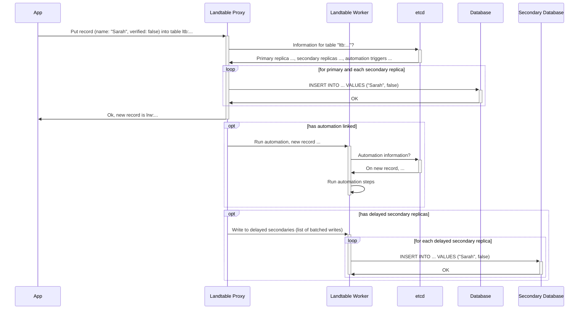

# landtable

> [!NOTE]
> Landtable is not ready for deployment. Nothing is finalised.
> No support is given if you try deploy Landtable right now.

Landtable is a familiar, easy-to-use proxy between your application and your
database. It provides a simpler interface to your database, so you can prototype
applications quickly.

## Who is Landtable for?

Landtable is primarily for people that already use products with similar APIs
and would like to migrate their data. While Landtable aims to be performant,
handling hundreds of thousands of operations per second is not a goal.

## Get started

As a quick, developer-oriented way to start using Landtable, let's
create some tables with a local Postgres instance. For this, you will
need these services **running** on your computer:

- etcd
- Postgres
- Landtable

First, we'll start a Landtable instance.

```
landtable &
```

Then, we'll tell the Landtable IaC tool how to create tables.

```kdl
// meta.kdl
type "meta"
version 1

// Use the authentication plugin that effectively does nothing.
// Don't use this in production!
auth "unsafe_allow_all_requests_i_know_what_i_am_doing" {}

provisioning {
    strategy "Postgres" {
        using "postgres_provisioning_plugin"
        hostname "localhost"
        
        authentication "none"
        
        // or:
        /-authentication "userpass" {
            username "sarah"
            password "i_l0ve_hC!"
        }
    }
}
```

Then, we'll create a new workspace, and some tables inside it:

```kdl
// workspace.kdl
type "workspace"
version 1

name "High Seas"
alias "highseas"
alias "hs"

// Instructions on how to create this table from scratch.
// For this example, we'll just use 
primary_strategy extends="Postgres"

table "people" {
    // specify values as attributes...
    field "first_name" type="short_text"
    
    // ... or nested nodes
    field "last_name" {
        type "short_text"
        
        // change the column on the primary replica
        primary_config {
            column "name"
        }
    }
    
    // Computed fields!
    field "name" {
        type "formula"
        formula "{first_name} & \" \" & {last_name}"
    }
    
    field "email" type="email"
    
    // you can use nested nodes _and_ attributes even
    field "frumbicated_status" type="enum" {
        default "florp"
        
        enum "florp"
        enum "glorp"
        enum "gloop"
        enum "gleep"
    }
    
    // Landtable formulae can be saved in views!
    view "floorped_people" filter="{frumbicated_status} = \"florp\""
}
```

Deploy our changes with the Landtable IaC CLI:

```sh
$ landtable iac deploy workspace.kdl \  # deploy workspace.kdl
    --meta meta.kdl \                   # using meta.kdl
    --endpoint http://localhost:5963 \  # using a locally hosted endpoint

Computed execution plan in 512 ms

(1) postgres_provisioning_plugin: Create Postgres tables on localhost:5173
    - CREATE TYPE lt_people_enum_frumbicated_status AS (
        'florp',
        'glorp',
        'gloop',
        'gleep'
    )
    - CREATE TABLE lt_people (
        id uuid,
        first_name text,
        name text,  -- Overridden by field config
        email text,
        frumbicated_status lt_people_enum_frumbicated_status
    )

(2) Landtable: Create workspace High Seas
    - alias "highseas"
    - alias "hs"
    
(3) Landtable: Create table High Seas/people
    - short_text field "first_name"
    - short_text field "last_name"
        - with primary config override:
            - column: "name"
    - computed field "name"
        - formula: {first_name} & " " & {last_name}
    - email field "email"
    - enum field "frumbicated_status"
        - variant "florp"
        - variant "glorp"
        - variant "gloop"
        - variant "gleep"
        
(4) Landtable: Create view "floorped_people" on High Seas/people
    - filter: {frumbicated_status} = "florp"

Ok to continue? [y/N]: 

Provisioned in 2041 ms
```

And we're done! Let's insert a table to make sure everything works:

```
$ landtable exec put hs \
    --endpoint http://localhost:5963 \
    --record '{"first_name": "Sarah", "last_name": "C", "email": "sarah@example.com"}'
Created 1 record:
  lrw:...

$ landtable exec get hs lrw:... \
    --endpoint http://localhost:5963 \
    --field "first_name" \
    --field "name"
Fetched 1 record:
  lrw:...: {
    "first_name": "Sarah"
    "name": "Sarah C"
  }
```

## Licensing

Landtable is not open source software. Landtable is licensed under the
Polyform Perimeter license.

## Contributors

Thank you to:
- [Captainexpo-1](https://github.com/Captainexpo-1) for writing
  [an initial version of the Landtable formula parser](https://github.com/Captainexpo-1/Formula-Parser)
  (and agreeing to license the software under Landtable's license)

## Internals

### Landtable identifier format

Landtable uses a compact UUIDv4 representation (a UUIDv4 without the dashes).
Landtable identifiers start with:
- `lrw` for rows,
- `lfd` for fields,
- `ltb` for tables,
- `lwk` for workspaces.

Landtable keys (starting with `lky`) do not have a fixed representation.
Do not rely on there being one.

### Converting Airtable IDs to Landtable IDs

- cut off the first 3 characters (`recHiMhzCULf9TTF1` -> `HiMhzCULf9TTF1`)
- decode the rest as base62
- shuffle the bytes:
  - first 7 bytes of decoded identifier
  - 0b00000100
  - 0b10100000
  - last 7 bytes of decoded identifier (pad with zero bytes if needed)

### Journey of a request through Landtable

> [!NOTE]
> There are details not shown in the below diagram.
> It only aims to provide a high-level overview of how a request travels through
> Landtable.


```mermaid
sequenceDiagram
    participant app as App
    participant proxy as Landtable Proxy
    participant worker as Landtable Worker
    participant etcd
    participant database as Database
    participant database2 as Secondary Database
    
    app->>+proxy: Put record (name#colon; "Sarah", verified#colon; false) into table ltb#colon;...
    proxy->>+etcd: Information for table "ltb#colon;..."?
    etcd->>-proxy: Primary replica ..., secondary replicas ..., automation triggers ...
    
    loop for primary and each secondary replica
        proxy->>+database: INSERT INTO ... VALUES ("Sarah", false)
        database->>-proxy: OK
    end

    proxy->>-app: Ok, new record is lrw#colon;...
    
    opt has automation linked
        proxy->>+worker: Run automation, new record ...
        worker->>+etcd: Automation information?
        etcd->>-worker: On new record, ...
        worker->>-worker: Run automation steps
    end

    opt has delayed secondary replicas
        proxy->>+worker: Write to delayed secondaries (list of batched writes)

        loop for each delayed secondary replica
            worker->>+database2: INSERT INTO ... VALUES ("Sarah", false)
            database2->>-worker: OK
            deactivate worker
        end
    end
```