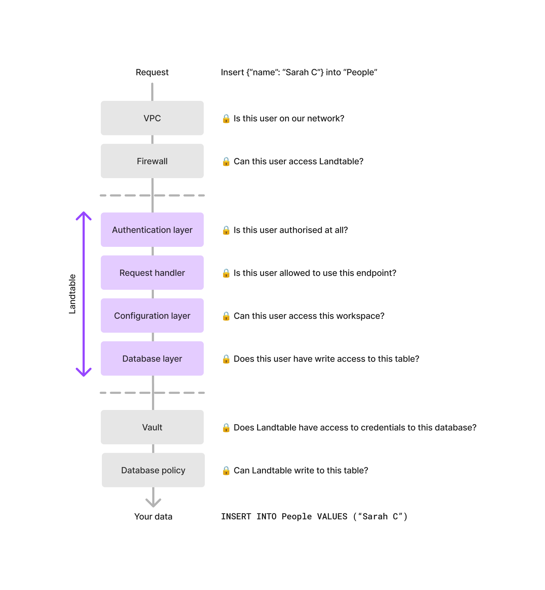

# Concepts

## High-level overview

```
Client --HTTP-> Landtable --SQL/HTTP/BSON-> your database
```

## Core concepts

For this section, it is assumed that you understand basic concepts about
a database.

### Workspaces

A workspace is a collection of [tables](#tables). It contains:
- [database backend](#database-backends) connection information
- [schema migration strategies](#schema-migration-strategies)
- [aliases](#aliases)

### Tables

A table contains your data. It contains:

- the schema (the fields)
- additional information for [database backends](#database-backends)
  (for example, the corresponding database column for this table)

### Database backends

Database backends tell Landtable how to fetch your data. To write a new
one, use Python package entry points. For a pyproject.toml example:

```toml
[project.entry-points."landtable.backends"]
postgres = "landtable.backends.postgres_backend:PostgresBackend"
```

See `landtable/backends/abstract.py` for a guide on how to write your
own database backend.

### Authentication plugins

An authentication plugin is something that tells Landtable who you are.
Authentication plugins provide [authentication contexts](#authentication-contexts).

Examples of authentication plugins include:

- a JWT plugin that provides contexts based on its claims
- an OpenID Connect plugin (for Slack)

### Authentication contexts

In Landtable, whether a user is allowed to do something is checked
at multiple points inside the program. This includes:

- at the request handler
- at the database backend level, where data is actually handled
- at the configuration level

An authentication context is an object that answers the fundamental
question of "is (subject) allowed to (action) on (resource)?".

While authentication contexts provide additional security, you are
responsible for ensuring that your authentication plugins are configured
correctly.

Authentication contexts provide another layer as part of a defense in
depth strategy.



### Database strategies

Database strategies manage database tables and Landtable tables on your
behalf.

For example, a database strategy would tell Landtable how to
delete a Postgres database column when you delete a field in a table.